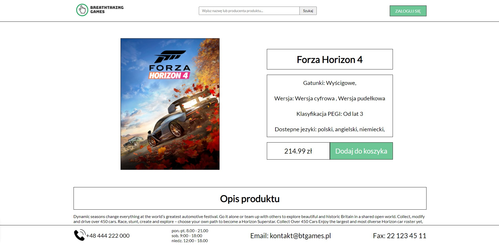
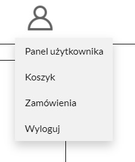
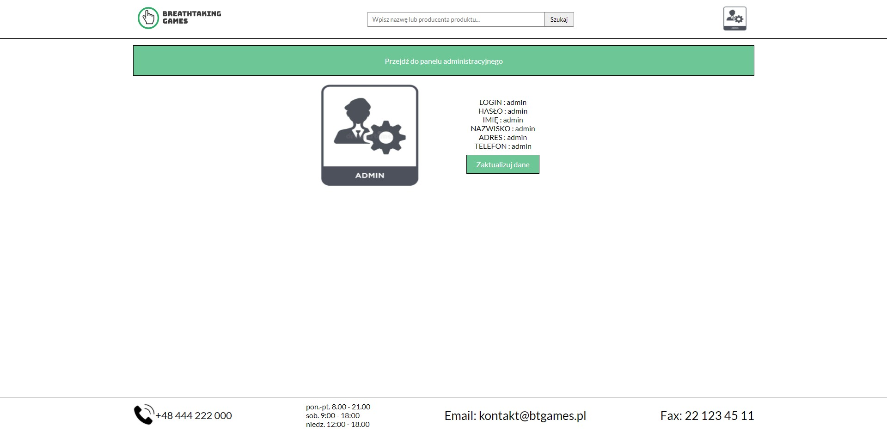
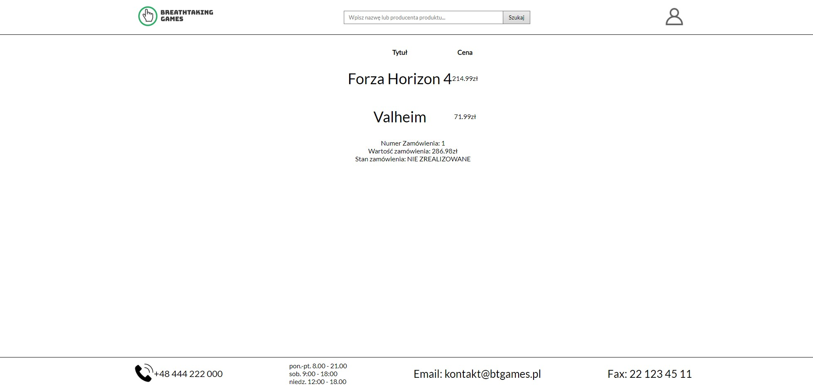

# BTGames

## Spis treści
Polkowski Cezary --V

* [Wprowadzenie](#Wprowadzenie)
* [Języki](#Języki)
* [Instalacja](#Instalacja)
* [Zakresy funkcjonalności](#Zakresy-funkcjonalności)
* [Instrukcja](#Instrukcja)

-[Logowanie](#Logowanie)

-[Rejestracja](#Rejestracja)

-[Przypominanie hasła](#Przypominanie-hasła)

-[Wylogowanie](#Wylogowanie)

-[Wyszukiwanie i filtry](#Wyszukiwanie-i-filtry)

-[Brak produktów](#Brak-produktów)

-[Dodawanie do koszyka](#Dodawanie-do-koszyka)

-[Panel użytkownika](#Panel-użytkownika)

-[Panel administracyjny](#Panel-administracyjny)

-[Koszyk](#Koszyk)

-[Zamówienia](#Zamówienia)

* [Inne informacje](#Inne-informacje)

## Wprowadzenie
Michał Malinowski --V
BTGames to projekt sklepu internetowego z grami video. Program pomagaw odnalezieniu gier o pożądanych przez nas wartościach, takich jak: kategoria, cena, przedział wiekowy, język, producentetc. Wyniki wyszukiwania można ostatecznie posortować według: ceny, datywydaniaoraz nazwy.BTGames powstał w ramach zajęć z Zarządzania projektem programistycznym.
## Języki
Polkowski Cezary --V
Przy tworzeniu projektu zostały użyte:
* PHP: 8.0.3
* HTML: 5
* CSS: 4
* MySQL 8.0.3
* ECMAScript(JavaScript) 2018

## Instalacja
Polkowski Cezary --V
Aby projekt działał, należy mieć zainstalowany pakiet XAMPP o minimalnej wersji PHP 7.3.25. umieścić W folderze xampp znajduje się folder o nazwie htdocs. To w nim należy stworzyć folder o nazwie projektu i do niego wypakować wszystkie plikitworzące projekt. Aby uruchomić projekt należy:
1.	Włączyć usługi Apache i MySQL. 
2.	Otworzyć przeglądarkę internetową.
3.	Wpisać w pasek wyszukiwania ścieżkę względną od folderu htdocs do pliku index.php (Jeśli nie były tworzone pod-foldery to ścieżka powinna wyglądać następująco “localhost/*nazwa folderu z plikami projektu*/index.php”)

## Zakresy funkcjonalności
Łukasz Dmitruk --V
* Strona głównawyświetla listę gier zawartych w bazie danych.
* Wyszukiwanie z użyciem filtrów lub nazwy produktów.
* Dodawanie danych do koszyka oraz składanie zamówień.
* Poza zalogowaniem się, możemy również założyć konto oraz przypomnieć hasło.
* Panel użytkownika pozwala użytkownikowi na podejrzenie swoich danych oraz ich zmianę, a także wylogowanie się.
* Koszyk i zamówienia przechowują dane o wybranych przez użytkownika artykułach oraz o złożonych przez niego zamówieniach.
* Panel administracyjny umożliwia dodawanie i usuwanie gier, języków, kategorii oraz producentów, a także zmianę stanu realizacji zamówień złożonych przez użytkownika.

## Instrukcja

Polkowski Cezary --V
### Logowanie

Po wejściu na stronę główną w prawym głównym rogu wyświetla się zielony przycisk “ZALOGUJ SIĘ”.

Po jego kliknięciu użytkownik zostanie przeniesiony na stronę logowania. Jeśli użytkownik posiada konto i wpisze jego odpowiednie dane to zostanie zalogowany i przeniesiony na stronę index.php

### Rejestracja

W przypadku gdy użytkownik nie posiada konta w panelu logowania należy kliknąć opcję “Załóż konto”. Po jego kliknięciu użytkownik zostanie przeniesiony na stronę rejestracji.

Użytkownik powinien wpisać dane, które będą przypisane do założonego konta, według schematu.
Po wprowadzeniu danych należy kliknąć przycisk “Załóż konto”. Po udanej rejestracji powinna wyświetlić się informacja oraz link do strony głównej.

### Przypominanie hasła

W przypadku gdy użytkownik nie pamięta hasła do konta należywpanelulogowaniakliknąć przycisk“Zapomniałem hasła”. Poprzez podanie e-maila oraz numeru telefonuwyświetlony zostanie formularz ustawiający nowe hasło. Po jego wypełnieniu wyświetli się informacja, że hasło zostało zaktualizowaneoraz link to strony głównej

###Wylogowanie

Gdy użytkownik jest zalogowany może się on wylogować poprzez:
1.	Kliknięcie swojego zdjęcia profilowego w prawym górnym rogu strony
2.	Kliknięcie przycisku wyloguj na wyświetlonej liście

### Wyszukiwanie i filtry

Na stronie są 2 sposoby znajdowania wybranych produktów:
1.	Wyszukiwanie po nazwie/producencie
Na górze strony znajduje się panel wyszukiwania. Po wpisaniu frazy lub kliknięciu na jeden z zaproponowanych elementów i potwierdzeniu wyszukiwania przez przycisk ‘Szukaj’ zadziała skrypt który wyszukuje produkty.

2.	Wyszukiwanie po filtrach

W lewej części strony znajduje się panel z filtrami. Są w nim umieszczone:
-Miejsca do wpisania minimalnej i maksymalnej ceny,
-Rozwijana lista producentów,
-Pola typu checkbox z kategoriami,
-Pola typu checkbox z kategoriami wiekowymi,
-Pola typu checkbox z wersjami językowymi,
- Rozwijana lista sposobów sortowania.
Po wybraniu filtrów należy kliknąć przycisk ‘Wyszukaj’.Aby wyzerować filtry należy kliknąć w ikonkę ‘X’.

### Brak produktów 
Michał Malinowski --V

Po załadowaniu strony z bazy danych wczytywana jest ilość każdego produktu. Następnie,jeżeli okaże się, że nie ma odpowiedniej ilości sztuk produktu w celu sprzedaży to przycisk “Kup teraz” zmieni kolor na szary, treść przycisku będzie pisała Brak oraz klikanie przycisku nie przyniesie żadnego wyniku. Takie zabezpieczenie jest także zastosowane na stronie z produktem.

### Dodawanie do koszyka

W celu dodania produktu do koszyka należy przejść do strony dedykowanej dla określonego produktu, co możemy zrobić poprzez wybranie produktu ze strony głównej i kliknięcie w przycisk “Kup teraz”.

Po kliknięciu w link powinniśmy zostać przeniesieni na stronę z określonym produktem, która wygląda mniej więcej tak: 

Na tej stronie znajdują się przydatne informacje o produkcie takie jak opis albo kategorie. W celu dodania produktu do koszyka należy wcisnąć przycisk “Dodaj do koszyka”. Jeżeli okaże się, że nie jesteśmy zalogowani to przycisk przekieruje nas na stronę logowania. Po zalogowaniu ponownie należy wejść na stronę z produktem i wcisnąć przycisk “Dodaj do koszyka”. Przycisk “Dodaj do koszyka” zostanie zastąpiony przyciskiem “Brak towaru” jeżeli w magazynie nie będzie już tego produktu. W takim przypadku prosimy wybrać inny produkt. Jeżeli wszystko zostało wykonane poprawnie i produkt jest dostępny w magazynie (ilość produktów w bazie danych pozwala na sprzedaż produktu), produkt powinien pojawić się w koszyku. Do koszyka możemy przejść klikając na ikonę użytkownika, po chwili powinna wyświetlić się rozwijana lista służąca do nawigacji po stronach.

Następnie jeżeli chcemy przejść do koszyka należy wcisnąć opcje “Koszyk” z listy, wtedy powinniśmy zostać przekierowani do koszyka gdzie znajdują się wszystkie dodane przez nas produkty.  

Łukasz Dmitruk --V

### Panel użytkownika

Po wejściu do panelu użytkownika dostajemy możliwość wyświetlenia danych użytkownika po wpisaniu hasła.

Po podaniu hasła na stronie zostaną wypisane wszystkie przechowywane dane dotyczące konta użytkownika takie jak: login, hasło, imię, nazwisko, adres i telefon.

Po kliknięciu przycisku ‘Zaktualizuj dane’ użytkownik ma możliwość zmiany swoich danych.

### Panel administracyjny

Aby przejść do panelu administratora należy przejść do panelu użytkownika zalogowanym jako administrator i kliknąć przycisk widoczny na górze strony

Po wejściu do panelu administratora możemy wybrać operację, którą chcemy dokonać.

W przypadku dodawania gier, zmiany stanu realizacji zamówień oraz usuwania gier, języka, kategorii i producenta,wyświetlane są aktualne dane i wszystkie możliwe opcje.
#### Przykładowe dodawanie

#### Przykładowe usuwanie

 Po specyfikowaniu parametrów przekazywane są one do bazy danych.

### Koszyk

Koszyk przechowuje informacje o dodanych przez użytkownika artykułach. Użytkownik może usuwać pozycje z koszyka, a także złożyć zamówienie.

### Zamówienia

Zamówienia przechowują informacje o produktach zamówionych przez użytkownika, numerze zamówienia, cenie jednostkowej, cenie łącznej jak i o stanie realizacji zamówienia.

## Inne informacje

* Status projektu: Zakończony

* Autorzy:
-Michał Malinowski
-Cezary Polkowski 
-Łukasz Dmitruk

* Licencja: Freeware

 Projekt został zakończony i nie jest planowane jego dalsze rozwijanie

 Ilustracje - Michał Malinowski
